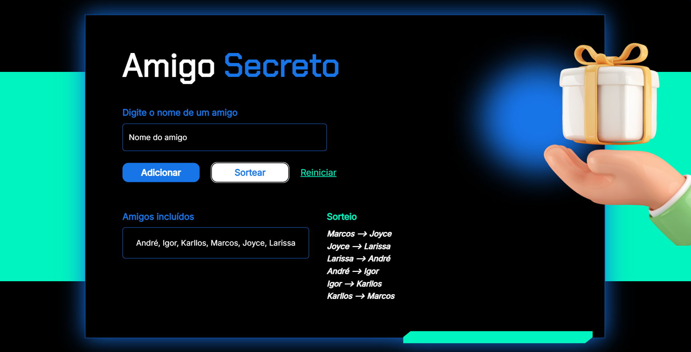

# 🎁 Amigo Secreto

Projeto web simples e divertido para organizar e sortear amigos em um **Amigo Secreto** de forma automática!
Sem papelzinho, sem confusão. Apenas digite os nomes e clique em sortear!

## 🚀 Funcionalidades

* ✅ Adicionar nomes de amigos à lista
* ✅ Validação para evitar nomes duplicados ou campos vazios
* ✅ Sorteio automático que garante que cada amigo tenha um par secreto
* ✅ Opção para reiniciar e começar um novo sorteio

## 📸 Preview



## 🛠️ Tecnologias usadas

* **HTML5** - Estruturação da página
* **CSS3** - Estilização com foco em um design moderno e colorido
* **JavaScript (Vanilla)** - Lógica do sorteio e interatividade
* **Google Fonts** - Chakra Petch & Inter para uma tipografia estilosa
* **Normalize & Reset CSS** - Para padronizar o comportamento em todos os navegadores

## 💡 Como usar

1. Abra o arquivo `index.html` no seu navegador.
2. Digite o nome de cada amigo e clique em **Adicionar**.
3. Após adicionar pelo menos 4 amigos, clique em **Sortear** para ver o resultado.
4. Se quiser começar novamente, clique em **Reiniciar**.

## 📂 Estrutura do Projeto

```
.
├── index.html
├── style.css
├── js
│   └── app.js
└── assets
    └── imagem-presente.png
```

## 🎲 Como funciona o sorteio?

O algoritmo embaralha a lista de amigos e conecta cada pessoa ao próximo da lista, criando uma corrente secreta. Por exemplo:

```
Ana --> João
João --> Maria
Maria --> Carlos
Carlos --> Ana
```

> ✅ O sorteio exige no mínimo **4 participantes** para garantir a dinâmica do jogo.

## 🚧 Melhorias futuras (Ideias)

* [ ] Limitar o número máximo de participantes
* [ ] Gerar um link secreto para cada participante com seu par revelado individualmente
* [ ] Responsividade total para dispositivos móveis
* [ ] Tema dark/light automático

## 👨‍💻 Autor

Feito com muito empenho por [Gustavo Marques](https://github.com/GustavoMarques22) 💙


---
